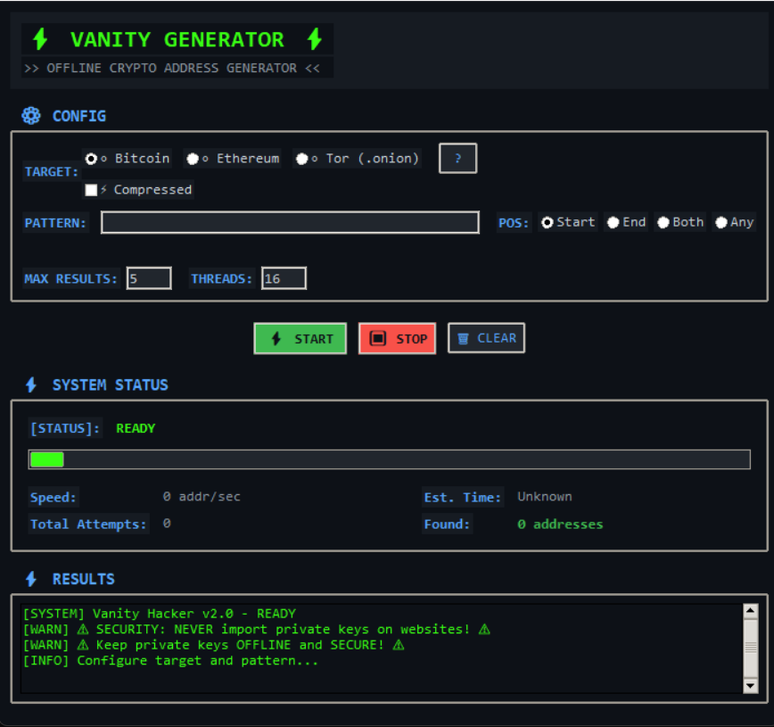

# 🎯 Vanity Address Generator

A secure, multithreaded, offline vanity address generator for Bitcoin, Ethereum, and Tor (.onion) addresses with dark hacker-themed GUI.

## 📸 Preview



*Dark hacker-themed interface with real-time pattern validation and multithreaded generation*

## ⚡ Features

### 🔒 Multi-Cryptocurrency Support
- **Bitcoin**: P2PKH addresses with uncompressed and compressed key support
- **Ethereum**: Standard addresses with real Keccak-256 hashing
- **Tor**: Version 3 .onion addresses with Ed25519 cryptography

### 🎯 Advanced Pattern Matching
- **Position-based search**: Start, End, Both, or Anywhere in address
- **Case-sensitive Bitcoin**: Proper Base58 validation (excludes 0, O, I, l)
- **Real-time validation**: Pattern validation with detailed error messages
- **Dual patterns**: Start and end pattern matching for complex searches

### ⚙️ Technical Features
- **Multithreaded generation**: Configurable worker threads for optimal performance
- **Thread-safe counters**: Accurate statistics with proper synchronization
- **CPU-only operation**: No GPU dependencies, runs anywhere
- **Completely offline**: Zero network requirements for maximum security
- **Cryptographically secure**: Uses industry-standard libraries and algorithms

### 🎨 User Interface
- **Dark hacker theme**: Professional cyberpunk-style GUI
- **Real-time progress**: Live updates with speed calculations
- **Comprehensive statistics**: Thread performance and generation metrics
- **Auto-save results**: Automatic file output with detailed metadata

### 🔐 Security Features
- **No dangerous fallbacks**: Removed insecure key generation methods
- **Proper key validation**: Strict cryptographic validation for all currencies
- **Private key security**: Secure WIF format with compression support
- **Thread safety**: Race condition protection for accurate counting

## 📦 Installation

### Quick Setup
```bash
python install.py
```

### Manual Installation
```bash
pip install cryptography>=41.0.0 pycryptodome>=3.19.0 base58>=2.1.1
```

## 🚀 Usage

### 1. Launch Application

#### Using Startup Scripts (Recommended)

**Linux/macOS:**
```bash
chmod +x start.sh
./start.sh
```

**Windows:**
```cmd
start.bat
```

The startup scripts will:
- ✅ Check Python 3.7+ installation
- ✅ Verify all dependencies 
- ✅ Auto-install missing packages
- ✅ Create output directory
- ✅ Display security warnings
- ✅ Launch the application safely

#### Manual Launch
```bash
python main.py
```

### 2. Configure Generation
- **Target**: Select Bitcoin, Ethereum, or Tor
- **Bitcoin Options**: Enable compressed keys for modern wallet compatibility
- **Pattern**: Enter desired text (validated in real-time)
- **Position**: Choose where pattern should appear
- **Parameters**: Set max results and thread count

### 3. Advanced Options
- **Compressed Bitcoin**: Generates K/L-prefix WIF keys and smaller addresses
- **Dual patterns**: Use "Both" position for start+end pattern matching
- **Thread optimization**: Use 1-4 threads per CPU core for best performance

## 📁 Output Format

Results saved to `output/` directory:
```
{crypto}_vanity_{pattern}_{timestamp}.txt
```

### File Contents
```
🎯 VANITY ADDRESS FOUND
==================================================
Cryptocurrency: Bitcoin (Compressed)
Address: 1HackerXYZ7n8KvLK3b9y4RWdnWJjhqkKq
Private Key: L1234567890abcdef... (WIF format)
Pattern: Hacker
Position: Start
Thread ID: 2
Thread Attempts: 15,847
Total Attempts: 45,231
Generation Time: 2024-09-02 14:30:15
==================================================
```

## 🔧 Technical Specifications

### Cryptographic Libraries
- **Bitcoin**: secp256k1 with uncompressed/compressed support
- **Ethereum**: Real Keccak-256 (not SHA-3) via pycryptodome
- **Tor**: Ed25519 with proper onion v3 generation

### Address Formats
- **Bitcoin**: P2PKH (1...) with Base58 encoding
  - Uncompressed: 65-byte public key → WIF starting with "5"
  - Compressed: 33-byte public key → WIF starting with "K" or "L"
- **Ethereum**: 40-character hex addresses with 0x prefix
- **Tor**: 56-character base32 addresses with .onion suffix

### Pattern Validation
- **Bitcoin**: Base58 alphabet (excludes 0, O, I, l) - case sensitive
- **Ethereum**: Hexadecimal (0-9, a-f) - case insensitive
- **Tor**: Base32 (a-z, 2-7) - case insensitive

## ⚡ Performance Guide

### Optimization Tips
- **Thread count**: Use CPU core count × 2-4 for optimal throughput
- **Pattern length**: Each additional character increases difficulty exponentially
- **Position strategy**: "Start" is fastest, "Anywhere" is slowest
- **Compression**: Compressed Bitcoin keys may generate faster

### Difficulty Estimates
| Pattern Length | Bitcoin (58^n) | Ethereum (16^n) | Tor (32^n) |
|---------------|----------------|-----------------|------------|
| 3 characters  | ~195K attempts | ~4K attempts   | ~33K attempts |
| 4 characters  | ~11M attempts  | ~65K attempts  | ~1M attempts |
| 5 characters  | ~660M attempts | ~1M attempts   | ~33M attempts |

## 🛡️ Security Considerations

### Private Key Safety
- **NEVER share private keys** - they provide full control over funds
- **Store securely** - use encrypted storage or hardware wallets
- **Backup properly** - lose the key = lose the funds permanently
- **Test with small amounts** before using for significant funds

### Cryptographic Security
- **True randomness**: Uses OS-provided cryptographically secure random sources
- **Standard algorithms**: Implements official specifications for all currencies
- **No shortcuts**: All keys are generated through proper cryptographic processes
- **Validation**: Strict checks prevent invalid or weak key generation

### Operational Security
- **Offline generation**: Run on air-gapped systems for maximum security
- **Clean environment**: Use dedicated systems for key generation
- **Secure disposal**: Properly wipe memory and temporary files after use

## 📋 Requirements

### System Requirements
- **Python**: 3.7+ (3.9+ recommended)
- **OS**: Windows, Linux, macOS
- **Memory**: 2GB+ RAM recommended for multithreading
- **Storage**: Minimal disk space (results files only)

### Dependencies
```
cryptography>=41.0.0    # secp256k1, Ed25519
pycryptodome>=3.19.0    # Real Keccak-256
base58>=2.1.1           # Bitcoin address encoding
tkinter                 # GUI (usually included with Python)
```

## 🔍 Troubleshooting

### Common Issues
- **Pattern validation errors**: Check character restrictions for each currency
- **Slow generation**: Reduce thread count or use shorter patterns
- **Memory usage**: Lower thread count on systems with limited RAM
- **GUI issues**: Ensure tkinter is properly installed

### Linux-Specific Issues
If tkinter is missing on Linux, install it with your package manager:
```bash
# Ubuntu/Debian
sudo apt-get install python3-tk

# RHEL/CentOS
sudo yum install tkinter

# Arch Linux
sudo pacman -S tk
```

### Performance Issues
- **High CPU usage**: Normal for CPU-intensive generation
- **Thread conflicts**: Use recommended thread counts
- **Pattern too long**: Exponential difficulty increase with length

## ⚠️ Legal Disclaimer

This software is provided for **educational and legitimate purposes only**:

- ✅ **Learning cryptography** and address generation
- ✅ **Personal wallet creation** with custom addresses
- ✅ **Testing and development** of blockchain applications
- ❌ **Illegal activities** or attempts to compromise existing addresses
- ❌ **Brute force attacks** on addresses you don't own
- ❌ **Any malicious use** that violates local laws

### User Responsibilities
- **Legal compliance**: Follow all applicable laws and regulations
- **Security practices**: Implement proper key management and storage
- **Financial risk**: Understand cryptocurrency risks and limitations
- **Due diligence**: Test thoroughly before using for valuable transactions

### Liability Limitation
The developers assume **no responsibility** for:
- Loss of funds due to improper use
- Security breaches or key compromises  
- Legal issues arising from software use
- Any damages direct or indirect from this software

**Use at your own risk and discretion.**

---

## 🤝 Contributing

Feel free to contribute improvements, bug fixes, or additional features. Please ensure all cryptographic implementations follow security best practices.

## 📄 License

This project is released under the MIT License. See LICENSE file for details.

---

**Remember: Generated private keys control real cryptocurrency addresses. Handle with extreme care.**
